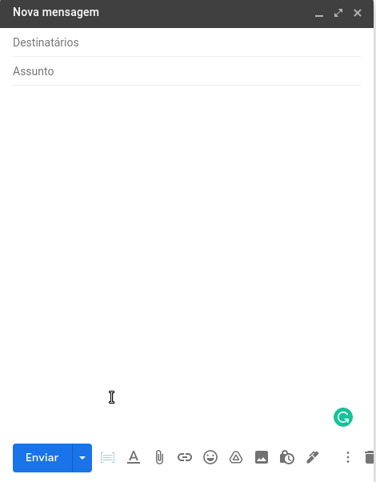

# GMAIL TEMPLATES APP

Gmail extension that allow you to manage text snippets to be used in your email messages.

  

## Installation

Run `npm install`

In your chromium based browser (e.g., Google Chrome, Brave), access your extensions page (e.g., `brave://extensions/`), turn on the `Developer mode`, and click on `Load unpacked`: in the open window choose the `extension` folder in the root of this repository.

With that you're ready to go, just open your gmail account and see the option available in the toolbar of your message compose.

The snippets will be open in an iframe pointing to `https://gmail-templates-app.herokuapp.com`. Please keep in mind that this is a Heroku free machine, so you may need to wait a few seconds before to see someting in the iframe until the Heroku app wake up.

## Troubleshooting

The snippets are stored inside the browser `localStorage` under the key `gmail-template-app_snippets`. If you may face some trouble loading the sneepets, just remove any previous register you have in your localStorage under this key.

## Nice features and improvements to implement

- Move from `localStorage` to a database (Firebase maybe?);
- When you click in the snippet to be put in your draft, close the iframe;
- Make the snippets icon in the email compose toolbar have `cursor: pointer`.

If you wanna contribute, fill free to send a pull request.
